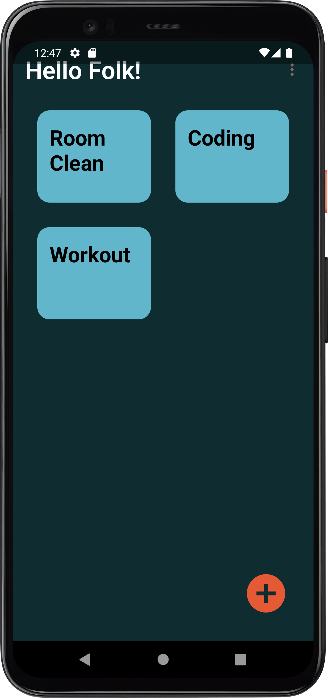

# Custimer 
Custimer is app used to create your task where you can arrange you task instructions easily. 
There is countdown timer for every task, using this app you can easily beat lazziness.

  

## Built With 🛠

- [Kotlin](https://kotlinlang.org/) - First class and official programming language for Android development.
- 
- [Coroutines](https://kotlinlang.org/docs/reference/coroutines-overview.html) - For asynchronous and more..
- [Android Architecture Components](https://developer.android.com/topic/libraries/architecture) - Collection of libraries that help you design robust, testable, and maintainable apps.
  - [LiveData](https://developer.android.com/topic/libraries/architecture/livedata) - Data objects that notify views when the underlying database changes.
  - [ViewModel](https://developer.android.com/topic/libraries/architecture/viewmodel) - Stores UI-related data that isn't destroyed on UI changes. 
  - [Room](https://developer.android.com/topic/libraries/architecture/room) - SQLite object mapping library.
- [Navigation Graph](https://developer.android.com/guide/navigation/navigation-design-graph) - The Navigation component uses a navigation graph to manage your app's navigation.  
- [Dagger 2](https://dagger.dev/) - Dependency Injection Framework
- [Retrofit](https://square.github.io/retrofit/) - A type-safe HTTP client for Android and Java.
- [Coil](https://github.com/coil-kt/coil/) - An image loading library for Android backed by Kotlin Coroutines.
- [Material Components for Android](https://github.com/material-components/material-components-android) - Modular and customizable Material Design UI components for Android.
